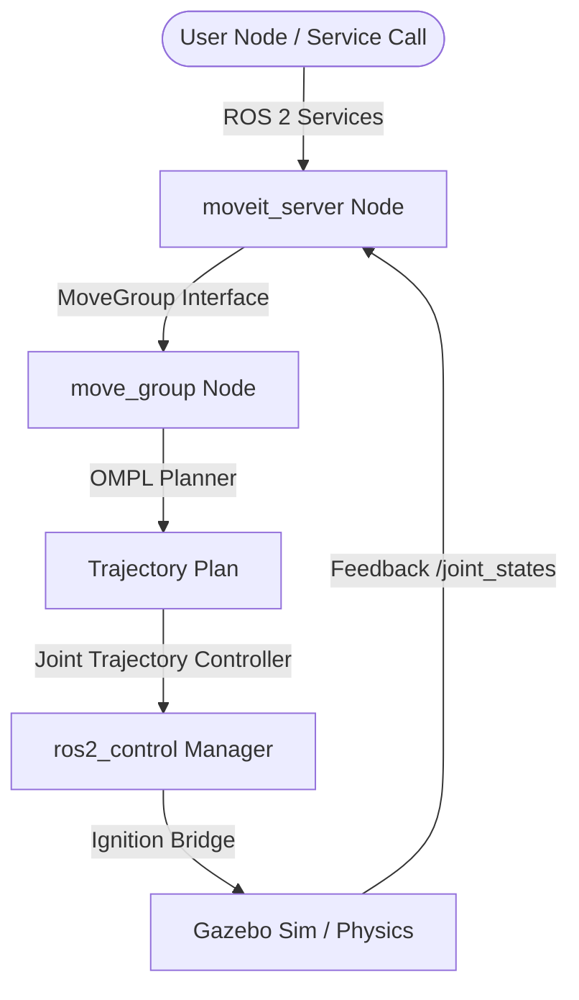

# 🤖 SO101 Autonomous Pick & Place

An autonomous 3D simulation and motion planning workspace for the **SO-101 (SO-ARM101)** 6-axis robotic arm. Built on **ROS 2 (Humble/Iron)**, **Gazebo (Ignition) Simulation**, and **MoveIt 2**, this repository provides a unified control interface, description models, simulation scenes, and custom C++ servers to execute motion planning, relative rotation, and pick-and-place tasks.

---

## 📝 Project Description

This workspace is designed to simulate and control the **SO-101 (SO-ARM101)** 6-axis robotic arm in a virtual 3D environment for automated material handling. It provides a complete control stack utilizing ROS 2 (Robot Operating System) and MoveIt 2 to calculate collision-free trajectories and interact with objects in Gazebo.

### How It Works
* **Simulation Scene:** A virtual environment is spawned in Gazebo Sim containing the SO-101 arm model and target objects.
* **Service-Oriented Control:** Rather than manually scripting joint trajectory waypoints, the custom C++ `moveit_server` node exposes high-level service endpoints. Other nodes or developers can trigger picks, places, or joint movements with simple service requests.
* **Kinematics & Planning:** MoveIt 2 handles the complex mathematics of inverse kinematics (converting target Cartesian coordinates into 6-axis joint angles) and schedules joint trajectories using OMPL path planners to ensure smooth, collision-free execution.
* **Teleoperation Support:** Includes configurations for both follower and leader arms to facilitate manual teleoperation or demonstration recording.

---

## 🌟 Key Components

The repository is structured into standard ROS 2 packages inside the `src/` directory:

1. **`so101_description`**: Houses the URDF and visual/collision mesh files representing the SO-101 6-axis robotic arm.
2. **`so101_gazebo`**: Configures the Gazebo (Ignition) simulation settings, physical properties, world files, and hardware plugins.
3. **`so101_moveit_config`**: Configuration package generated by the MoveIt Setup Assistant for the follower arm, defining kinematic limits, planning groups (`arm` and `gripper`), and controller parameters.
4. **`so101_leader_moveit_config`**: MoveIt configuration package for the leader teleoperation arm to enable remote mimicry.
5. **`so101_unified_bringup`**: The core orchestration package that launches both Gazebo and MoveIt, hosts custom services, and configures OMPL planning parameters.

---

## 🏗️ System Architecture

The project utilizes a client-server architecture where a custom C++ `moveit_server` node exposes services to control the arm. The server processes request inputs, plans trajectories using OMPL planner groups via MoveIt 2's API, and executes joint goals or Cartesian paths inside the Gazebo simulation.


---

## 📡 Custom Services API

The C++ `moveit_server` node registers the following ROS 2 services to simplify motion planning and teleoperation:

| Service Name | Service Type | Description |
|---|---|---|
| `/create_traj` | `so101_unified_bringup/srv/PoseReq` | Plans and executes a Cartesian path to a target 3D Pose |
| `/move_to_joint_states` | `so101_unified_bringup/srv/JointReq` | Plans and executes a path to a set of target Joint Angles |
| `/rotate_effector` | `so101_unified_bringup/srv/RotateEffector` | Rotates the wrist roll joint by a specified relative delta |
| `/sync_arm` | `so101_unified_bringup/srv/JointSat` | Syncs follower state or reports joint saturation metrics |
| `/pick_object` | `so101_unified_bringup/srv/PickObject` | Automatically approaches, grips, and lifts a target object |
| `/place_object` | `so101_unified_bringup/srv/PlaceObject` | Places the gripped object at a designated drop-off target |
| `/pick_front` | `so101_unified_bringup/srv/PickFront` | Executes a pre-configured pick routine targeting the front sector |
| `/pick_left` | `so101_unified_bringup/srv/PickLeft` | Executes a pre-configured pick routine targeting the left sector |
| `/pick_right` | `so101_unified_bringup/srv/PickRight` | Executes a pre-configured pick routine targeting the right sector |
| `/pick_rear` | `so101_unified_bringup/srv/PickRear` | Executes a pre-configured pick routine targeting the rear sector |

---

## 🚀 Step-by-Step Installation Guide

Follow these sequential steps to set up the environment, install the required packages, clone the repository, and build the ROS 2 workspace.

### 📋 Step 1: Install Prerequisites & ROS 2 Dependencies
Ensure you have **ROS 2 (Humble or Iron)** and **Gazebo Sim** installed. Then, install the essential ROS 2 control, navigation, Gazebo integration, and MoveIt packages:
```bash
sudo apt update
sudo apt install -y \
  ros-$ROS_DISTRO-moveit \
  ros-$ROS_DISTRO-ros-gz \
  ros-$ROS_DISTRO-ros2-control \
  ros-$ROS_DISTRO-ros2-controllers
```

### 📂 Step 2: Create a ROS 2 Workspace Directory
Create a dedicated workspace directory for the project:
```bash
mkdir -p ~/so101_ws/src
cd ~/so101_ws/src
```

### 📥 Step 3: Clone the Repository
Clone the autonomous pick-and-place repository into your workspace's `src` folder:
```bash
git clone https://github.com/Hemanth-08-RA/SO101-Autonomous-Pick-and-Place.git
```

### 🔍 Step 4: Resolve Package Dependencies
Initialize and update `rosdep` to install any missing system dependencies required by the package:
```bash
cd ~/so101_ws
sudo rosdep init  # Only run if rosdep is not initialized yet
rosdep update
rosdep install --from-paths src --ignore-src -r -y
```

### 🔨 Step 5: Build the Workspace
Compile the ROS 2 packages using `colcon`:
```bash
colcon build --symlink-install
```

### 🔌 Step 6: Source the Workspace Environment
Source the built packages to overlay them onto your ROS 2 environment:
```bash
source install/setup.bash
```
*Tip: You can add `source ~/so101_ws/install/setup.bash` to your `~/.bashrc` file to automatically source the workspace in every new terminal.*

---

## 运行 / Execution

### 1. Launch Simulation + MoveIt 2 + C++ Server
Launch the complete environment including Gazebo Sim, MoveGroup controller, RViz visualizer, and the custom service host server:
```bash
ros2 launch so101_unified_bringup main.launch.py
```
*Optional parameters:*
* `rviz:=false` (disable RViz visualizer window)
* `world:=<path>` (load a custom world file)
* `x:=<val> y:=<val> z:=<val>` (set custom initial coordinates for spawning the robot)

### 2. Launch Server Only (On Real Hardware or Independent Sim)
If you already have a simulator running or want to connect directly to the physical SO-101 robot arm:
```bash
ros2 launch so101_unified_bringup moveit_server.launch.py
```

### 3. Triggering Pick and Place Commands
Once the server is up and running, you can test the services by running service calls from another terminal.

* **Move to a specific joint state:**
  ```bash
  ros2 service call /move_to_joint_states so101_unified_bringup/srv/JointReq "{joints: {position: [0.1, -0.2, 0.3, 0.4, 0.5]}}"
  ```

* **Execute a Front Pick routine:**
  ```bash
  ros2 service call /pick_front so101_unified_bringup/srv/PickFront "{object_pose: {position: {x: 0.3, y: 0.0, z: 0.1}, orientation: {w: 1.0}}}"
  ```

* **Rotate the End-Effector:**
  ```bash
  ros2 service call /rotate_effector so101_unified_bringup/srv/RotateEffector "{roll_delta: 0.5}"
  ```

---

## 📄 License
This repository is licensed under the MIT License. See [LICENSE](LICENSE) for more details.